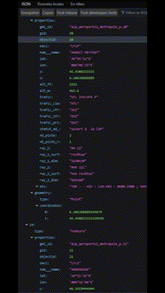
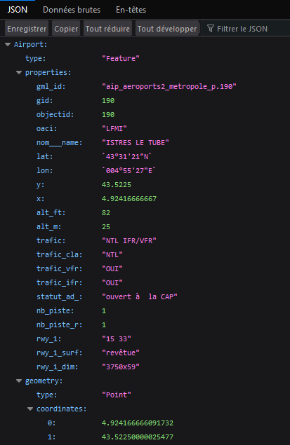
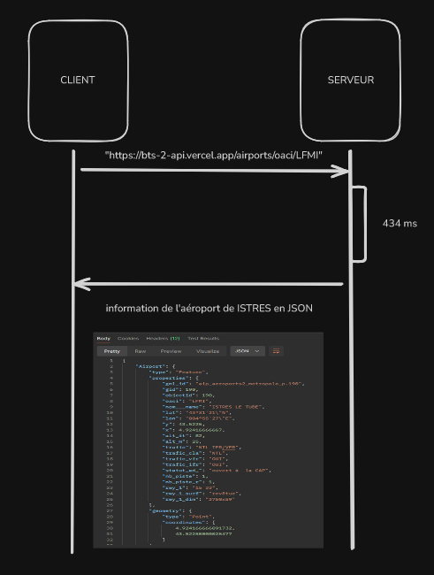
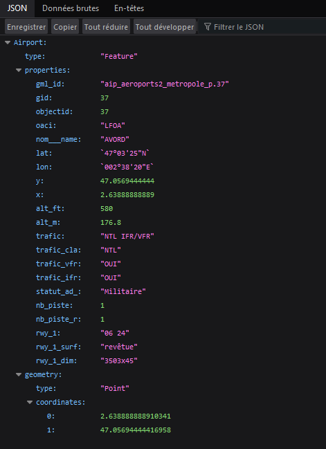

ESIEE-IT - (BTS SIO SLAM) - 03/09/2024

---

### 📜 **Faire une requête pour obtenir la liste de tous les aéroports de France.**

Afin d'obtenir la liste de tous les aéroports de France, je saisis la requête suivante :

`https://bts-2-api.vercel.app/airports`

Le serveur me renvoie la liste de tous les aéroports en JSON.



### 📜 **Faire une requête pour obtenir les informations de l’aéroport de Istres, dont le code OACI est LFMI. Accompagner la requête d’un diagramme de séquence décrivant la chaine de communication de l’envoie de la requête jusqu’à la réception de la réponse. **

La requête me permettant d'obtenir les informations de l'aéroport de Istres est la suivante :

`https://bts-2-api.vercel.app/airports/oaci/LFMI`

Voici ce que le serveur me renvoie : 



Voici un diagramme de séquence expliquant l'échange entre moi (client) et le serveur :



### 📜 **Faire une requête pour obtenir la liste des aéroports qui ont entre 2 et 3 pistes.**

Pour cela, il nous suffit d'utiliser les paramètres **`nbPistesMin`** et **`nbPistesMax`** et de les implémenter dans notre requête.

`https://bts-2-api.vercel.app/airports/nbPistes?nbPistesMin=2&nbPistesMax=3`

Le serveur renvoie une liste en **JSON** des aéroports ayants un nombre de pistes entre 2 et 3.


### 📜 **Faire une requête pour obtenir la liste des aéroports qui ont 4 pistes.**

On utilise les deux paramètres utilisés précédemment pour sélectionner seulement les aéroports qui ont 4 pistes. Voici la requête :

`https://bts-2-api.vercel.app/airports/nbPistes?nbPistesMin=4&nbPistesMax=4`

On peut citer les aéroports CAEN CARPIQUET, LILLE MARCQ EN BAROEUL ou bien MEAUX ESBLY.


### 📜 **Certains avions ont besoin d’une longueur de piste minimale pour décoller et atterrir. Faire une requête pour obtenir la liste des pistes où peut atterrir un Rafale (450m). Faire une requête pour obtenir la liste des aéroports où peut opérer un A380 qui a besoin de 2750m pour décoller et de 1524m pour atterrir.**

Cette fois on utilise la route **`longueurPiste`** avec le paramètre **`length`** servant à sélectionner les aéroports en fonction de la longueur de pistes.

`https://bts-2-api.vercel.app/airports/longueurPiste?length=450`

Cette requête retourne tous les aéroports où peut atterrir un Rafale.


Pour le A380, il faut sélectionner une longueur supérieure à 2750m.

`https://bts-2-api.vercel.app/airports/longueurPiste?length=2750`

Le serveur nous renvoie une liste d'aéroports où peut atterrir le A380. On peut citer le **`AVORD`**



### 📜 **Identifier un objet au sens "Programmation orientée objet" que retourne l'API en le documentant (nom + attributs)**

J'ai identifié l'objet Airport en lui attribuant un **`nom`**, un code **`oaci`**, des coordonnées telles que **`latitude`** et **`longitude`**, une **`longueur de piste minimum`** et un **`nombre de pistes`**.

```
public class Airport{

    private string oaci;
    private string name;
    private double latitude;
    private double longitude;
    private int longueurPisteMin;
    private int nbPistes;

    public Airport(string oaci, string name, double latitude, double longitude, int longueurPisteMin, int nbPistes)
    {
        this.oaci = oaci;
        this.name = name;
        this.latitude = latitude;
        this.longitude = longitude;
        this.longueurPisteMin = longueurPisteMin;
        this.nbPistes = nbPistes;
    }

    public string GetOaci(){
        return oaci;
    }

    public string GetName(){
        return name;
    }

    public double GetLatitude(){
        return latitude;
    }

    public double GetLongitude(){
        return longitude;
    }

    public int GetLongueurPisteMin(){
        return longueurPisteMin;
    }

    public int GetNbPistes(){
        return nbPistes;
    }

    public void SetOaci(string oaci){
        this.oaci = oaci;
    }

    public void SetName(string name){
        this.name = name;
    }

    public void SetLatitude(double latitude){
        this.latitude = latitude;
    }

    public void SetLongitude(double longitude){
        this.longitude = longitude;
    }

    public void SetLongueurPisteMin(int longueurPisteMin){
        this.longueurPisteMin = longueurPisteMin;
    }

    public void SetNbPistes(int nbPistes){
        this.nbPistes = nbPistes;
    }
}
```